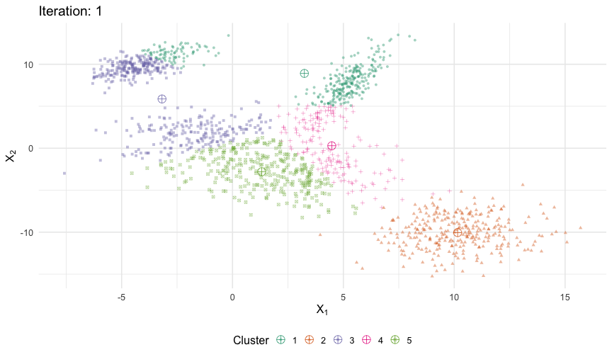

```{r setup, include=FALSE}
options(htmltools.dir.version = FALSE)
knitr::opts_chunk$set(cache = TRUE, echo = FALSE, message = FALSE, warning = FALSE,
                      fig.retina = 2, fig.width = 12)

library(tidyverse)
library(tidymodels)
library(patchwork)
library(here)
library(tictoc)
library(ggdendro)
library(gganimate)
library(cluster)
library(factoextra)

set.seed(1234)
theme_set(theme_minimal(base_size = 16))
```

$$\newcommand{\E}{\mathrm{E}} \newcommand{\Var}{\mathrm{Var}} \newcommand{\Cov}{\mathrm{Cov}} \newcommand{\se}{\text{se}} \newcommand{\Lagr}{\mathcal{L}} \newcommand{\lagr}{\mathcal{l}}$$

---

# Clustering

* Set of techniques for finding subgroups within a dataset
* Partition dataset into similar and distinct groups
* Distinguished from dimension reduction
* Applications in social science
    * [Defining types of political regimes](https://file.scirp.org/pdf/AM_2014081916212927.pdf)
    * [Validating typologies](https://www.jstor.org/stable/pdf/41403740.pdf)
    * [Creating personality profiles](https://www.ncbi.nlm.nih.gov/pmc/articles/PMC4005932/)

---

# Distance measures

* How to measure dissimilarity
* Distance-based metrics
* Correlation-based metrics
* Choice of metric matters
* Importance of standardization

---

# Distance-based metrics

## Euclidean distance
    
$$d_{\text{Euclidean}}(x,y) = \sqrt{\sum_{i=1}^n (x_i - y_i)^2}$$

## Manhattan distance
    
$$d_{\text{Manhattan}}(x,y) = \sqrt{\sum_{i=1}^n | x_i - y_i |}$$
    
---

# Correlation-based metrics

## Pearson correlation distance

$$d_\text{cor}(x,y) = 1 - \frac{\sum_{i=1}^n (x_i - \bar{x}) (y_i - \bar{y})}{\sqrt{\sum_{i=1}^n (x_i - \bar{x})^2 \sum_{i=1}^n (y_i - \bar{y})^2}}$$

## Spearman correlation distance

$$d_\text{spear}(x,y) = 1 - \frac{\sum_{i=1}^n (x'_i - \bar{x}') (y'_i - \bar{y}')}{\sqrt{\sum_{i=1}^n (x'_i - \bar{x}')^2 \sum_{i=1}^n (y'_i - \bar{y}')^2}}$$

* $x'_i = \text{rank}(x_i)$
* $y'_i = \text{rank}(y_i)$

---

# $K$-means clustering

* Specify the number of clusters in the data $K$
* Assign each observation to precisely one of those $K$ clusters

---

# Simulated dataset

```{r kmeans, echo = FALSE}
# simulate 5 cluster data
# data source: https://theanlim.rbind.io/post/clustering-k-means-k-means-and-gganimate/
set.seed(123)

x <- list(
  `1` = MASS::mvrnorm(n = 300, c(-4,10), matrix(c(1.5,1,1,1.5),2)),
  `2` = MASS::mvrnorm(n = 300, c(5,7), matrix(c(1,2,2,6),2)),
  `3` = MASS::mvrnorm(n = 300, c(-1,1), matrix(c(4,0,0,4),2)),
  `4` = MASS::mvrnorm(n = 300, c(10,-10), matrix(c(4,0,0,4),2)),
  `5` = MASS::mvrnorm(n = 300, c(3,-3), matrix(c(4,0,0,4),2))
) %>%
  map_df(as_tibble, .id = "cluster") %>%
  rename(x = V1,
         y = V2)

# estimate k clusters
x.out <- x %>%
  select(-cluster) %>%
  mutate(k2 = kmeans(x, 2, nstart = 20)$cluster,
         k3 = kmeans(x, 3, nstart = 20)$cluster,
         k4 = kmeans(x, 4, nstart = 20)$cluster,
         k5 = kmeans(x, 5, nstart = 20)$cluster,
         k6 = kmeans(x, 6, nstart = 20)$cluster,
         k7 = kmeans(x, 6, nstart = 20)$cluster)

# plot clusters
x.out %>%
  gather(K, pred, k2:k7) %>%
  mutate(K = parse_number(K),
         pred = factor(pred)) %>%
  ggplot(aes(x, y, color = pred)) +
  facet_wrap(~ K, labeller = label_both) +
  geom_point() +
  scale_color_brewer(type = "qual", palette = "Dark2") +
  theme(legend.position = "none")
```

---

# $K$-means clustering

* $C_1, C_2, \dots, C_K$
    * Each observation belongs to one of the $K$ clusters
    * Clusters are non-overlapping
* Within-cluster variation

    $$\min_{C_1, C_2, \dots, C_K} \left\{ \sum_{k = 1}^K W(C_k) \right\}$$

* Squared euclidean distance

    $$W(C_k) = \frac{1}{|C_k|} \sum_{i,i' \in C_k} \sum_{j = 1}^p (x_{ij} - x_{i'j})^2$$

* How to identify optimum cluster assignments

---

# $K$-means clustering

1. Randomly assign each observation to one of the $K$ clusters
1. Iterate over the cluster assignments
    1. For each of the $K$ clusters, compute the cluster centroid
    1. Assign each observation to the cluster whose centroid is closest

---

# $K$-means clustering

```{r kmeans-sim-animate, dependson = "kmeans", include = FALSE, eval = FALSE}
# animation source: https://smorbieu.gitlab.io/animate-intermediate-results-of-your-algorithm/
# initialize clustering model
set.seed(123)

dataset <- x
dataset <- dataset %>%
  mutate(sample = row_number())
centroids <- dataset %>%
  sample_n(5) %>%
  mutate(cluster = row_number()) %>%
  select(x, y, cluster)

# assignment step
assignmentStep <- function(samplesDf, centroids) {
  d <- samplesDf %>%
    select(x, y, sample)
  
  repCentroids <- bind_rows(replicate(nrow(d), centroids, simplify = FALSE)) %>%
    transmute(xCentroid = x, yCentroid = y, cluster)
  
  d %>%
    slice(rep(1:n(), each = 5)) %>%
    bind_cols(repCentroids) %>%
    mutate(s = (x - xCentroid)^2 + (y - yCentroid)^2) %>%
    group_by(sample) %>%
    top_n(1, -s) %>%
    select(sample, cluster, x, y)
}

# update step
updateStep <- function(samplesDf) {
  samplesDf %>%
    group_by(cluster) %>%
    summarise(x = mean(x), y = mean(y))
}

# iterations
maxIter <- 30
d <- data.frame(
  sample = c(),
  cluster = c(),
  x = c(),
  y = c(),
  step = c()
)

dCentroids <- data.frame(
  cluster = c(),
  x = c(),
  y = c(),
  step = c()
)

for (i in 1:maxIter) {
  df <- assignmentStep(dataset, centroids)
  updatedCentroids <- updateStep(df)
  
  if (all(updatedCentroids == centroids )) {
    break
  }
  
  centroids <- updatedCentroids
  d <- bind_rows(d, df %>%
                   mutate(step = i))
  dCentroids <- bind_rows(dCentroids, centroids %>%
                            mutate(step = i))
}

# plot change
a <- ggplot(d, aes(x = x, y = y, color = factor(cluster), shape = factor(cluster))) +
  labs(title = "Iteration: {previous_state}",
       x = expression(X[1]),
       y = expression(X[2]),
       color = "Cluster",
       shape = "Cluster") +
  geom_point(aes(group = sample), alpha = .4) +
  geom_point(data = dCentroids, shape = 10, size = 5) +
  scale_color_brewer(type = "qual", palette = "Dark2") +
  theme(legend.position = "bottom") +
  transition_states(step,
                    transition_length = 1,
                    state_length = 2,
                    wrap = FALSE) +
  enter_recolor() +
  exit_recolor()

animate(a, duration = 20, start_pause = 10, end_pause = 10)
```

.center[



]

---

# Multiple attempts

```{r kmeans-sim-start, dependson = "kmeans", echo = FALSE}
set.seed(125)
kmean.out <- rerun(6, kmeans(x %>%
                               select(-cluster), 5, nstart = 1))
withinss <- rep(map_chr(kmean.out, ~ .$tot.withinss), each = nrow(x))

kmean.out %>%
  map_df(~ enframe(.$cluster, name = NULL), .id = "id") %>%
  bind_cols(bind_rows(x, x, x, x, x, x)) %>%
  mutate(withinss = str_c("Within SS = ", withinss),
         id = str_c("Attempt #", id),
         value = factor(value)) %>%
  ggplot(aes(x, y, color = value)) +
  facet_wrap(~ id + withinss, ncol = 3, labeller = label_wrap_gen(multi_line = TRUE)) +
  geom_point() +
  scale_color_brewer(type = "qual", palette = "Dark2", guide = FALSE) +
  labs(title = "Convergence of k-means cluster algorithm",
       x = expression(X[1]),
       y = expression(X[2])) +
  theme(legend.position = "none")
```

---

# `USArrests`

```{r usarrests}
df <- USArrests %>%
  na.omit %>%
  scale
head(df)
```

---

# $K=2$

```{r usarrests-k2, dependson = "usarrests"}
k2 <- kmeans(df, centers = 2, nstart = 25)

fviz_cluster(k2, data = df) +
  scale_color_brewer(type = "qual", palette = "Dark2") +
  scale_fill_brewer(type = "qual", palette = "Dark2") +
  theme_minimal(base_size = 16)
```

---

# $K=2,3,4,5$

```{r usarrests-kmany, dependson = "usarrests"}
k3 <- kmeans(df, centers = 3, nstart = 25)
k4 <- kmeans(df, centers = 4, nstart = 25)
k5 <- kmeans(df, centers = 5, nstart = 25)

# plots to compare
p1 <- fviz_cluster(k2, geom = "point", data = df) +
  scale_color_brewer(type = "qual", palette = "Dark2") +
  scale_fill_brewer(type = "qual", palette = "Dark2") +
  theme_minimal(base_size = 16) +
  ggtitle("k = 2")
p2 <- fviz_cluster(k3, geom = "point",  data = df) +
  scale_color_brewer(type = "qual", palette = "Dark2") +
  scale_fill_brewer(type = "qual", palette = "Dark2") +
  theme_minimal(base_size = 16) +
  ggtitle("k = 3")
p3 <- fviz_cluster(k4, geom = "point",  data = df) +
  scale_color_brewer(type = "qual", palette = "Dark2") +
  scale_fill_brewer(type = "qual", palette = "Dark2") +
  theme_minimal(base_size = 16) +
  ggtitle("k = 4")
p4 <- fviz_cluster(k5, geom = "point",  data = df) +
  scale_color_brewer(type = "qual", palette = "Dark2") +
  scale_fill_brewer(type = "qual", palette = "Dark2") +
  theme_minimal(base_size = 16) +
  ggtitle("k = 5")

p1 + p2 + p3 + p4
```

---

# Determining optimal number of clusters

* Unsupervised learning
* No absolute metric for success

---

# Elbow method

$$\min \left(\sum_{k=1}^k W(C_k) \right)$$

* Total within-cluster sum of square $WSS$

1. Compute clustering algorithm for different values of $k$
1. For each $k$, calculate the $WSS$
1. Plot the curve of $WSS$ according to the number of clusters $k$
1. Find the bend in the graph

---

# Elbow method

```{r elbow, dependson = "usarrests"}
set.seed(123)
fviz_nbclust(df, kmeans, method = "wss")
```

---

# Silhouette width

1. For each observation $i$, calculate the average dissimilarity $a_i$ between $i$ and all other points of the cluster to which $i$ belongs
1. For all other clusters $C$, to which $i$ does not belong, calculate the average dissimilarity $d(i,C)$ of $i$ to all observations of $C$
    * The smallest of these $d(i,C)$ is defined as $b_i = \min_C d(i,C)$
    * Dissimilarity between $i$ and its "neighbor" cluster
1. Silhouette width of the observation $i$
    
    $$S_i = \frac{b_i - a_i}{\max(a_i, b_i)}$$
    
--

* Observations with a large $S_i$ are very well clustered
* Small $S_i$ means observation lies between two clusters
* Negative $S_i$ means observation is probably in the wrong cluster

---

# Average silhouette method

1. Compute clustering algorithm for different values of $K$
1. For each $K$, calculate the average silhouette of observations $\bar{S}_K$
1. Plot the curve of $\bar{S}_K$ according to $K$
1. Find $\max \bar{S}_k$

---

# Average silhouette method

```{r silhouette, dependson = "usarrests"}
set.seed(123)
fviz_nbclust(df, kmeans, method = "silhouette")
```

---

# Gap statistic

* Compares the total within intra-cluster variation for different values of $k$ with their expected values under a null reference distribution of the data
* Optimal clusters will be a value that maximize the gap statistic

---

# Gap statistic

1. Cluster the observed data, varying the number of clusters from $K = 1, \ldots, k_{max}$
1. Compute the corresponding total within intra-cluster variation $W_k$
1. Generate $B$ reference data sets with a random uniform distribution. Cluster each of these reference data sets with varying number of clusters $K = 1, \ldots, k_{max}$
1. Compute the corresponding total within intra-cluster variation $W_{kb}$
1. Compute the gap statistic

    $$\text{Gap}(k) = \frac{1}{B} \sum_{i=1}^B \log(W_{kb}^{*}) - \log (W_k)$$

1. Choose the number of clusters as the smallest value of $K$ such that the gap statistic is within one standard deviation of the gap at $K+1$
    
    $$\text{Gap}(k) \geq \text{Gap}(K + 1) - \text{s.d.}_{k + 1}$$

---

# Gap statistic

```{r gap-stat, dependson = "usarrests"}
# compute gap statistic
set.seed(123)
gap_stat <- clusGap(df, FUN = kmeans, nstart = 25,
                    K.max = 10, B = 50)

# Print the result
fviz_gap_stat(gap_stat)
```

---

# $K=4$

```{r usarrests-k4, dependson = "usarrests"}
# Compute k-means clustering with k = 4
set.seed(123)
final <- kmeans(df, 4, nstart = 25)

fviz_cluster(final, data = df) +
  scale_color_brewer(type = "qual", palette = "Dark2") +
  scale_fill_brewer(type = "qual", palette = "Dark2") +
  theme_minimal(base_size = 16) +
  ggtitle("k = 4")
```

---

# Hierarchical clustering

* Fixed $K$
* Hierarchical clustering
* Dendrograms

---

# Interpreting dendrograms

```{r dendro-sim, echo = FALSE}
set.seed(123)
# generate data
x <- tibble(x1 = rnorm(50) + 3,
            x2 = rnorm(50) - 4,
            y = ifelse(x1 < 3, "1",
                       ifelse(x2 > -4, "2", "3")))

ggplot(x, aes(x1, x2, color = y)) +
  geom_point() +
  scale_color_brewer(type = "qual", palette = "Dark2", guide = FALSE) +
  labs(title = "Simulated data",
       x = expression(X[1]),
       y = expression(X[2])) +
  theme(legend.position = "none")
```

---

# Interpreting dendrograms

```{r dendro-cluster, dependson="dendro-sim", echo = FALSE}
# estimate hierarchical cluster
hc.complete <- hclust(dist(x), method = "complete")

# plot
ggdendrogram(hc.complete)
```

---

# Interpreting dendrograms

```{r dendro-cut-4, dependson = "dendro-sim", echo = FALSE, message = FALSE, warning = FALSE}
h <- 4
# extract dendro data
hcdata <- dendro_data(hc.complete)
hclabs <- label(hcdata) %>%
  left_join(tibble(label = as.factor(seq.int(nrow(x))),
                       cl = as.factor(cutree(hc.complete, h = h))))

# plot dendrogram
ggdendrogram(hc.complete, labels = FALSE) +
  geom_text(data = hclabs,
            aes(label = label, x = x, y = 0, color = cl),
            vjust = .5, angle = 90) +
  geom_hline(yintercept = h, linetype = 2) +
  scale_color_brewer(type = "qual", palette = "Dark2", guide = FALSE) +
  theme(axis.text.x = element_blank(),
        legend.position = "none")
```

---

# Interpreting dendrograms

```{r dendro-cut-3, dependson = "dendro-sim", echo = FALSE, message = FALSE, warning = FALSE}
h <- 3
# extract dendro data
hcdata <- dendro_data(hc.complete)
hclabs <- label(hcdata) %>%
  left_join(tibble(label = as.factor(seq.int(nrow(x))),
                       cl = as.factor(cutree(hc.complete, h = h))))

# plot dendrogram
ggdendrogram(hc.complete, labels = FALSE) +
  geom_text(data = hclabs,
            aes(label = label, x = x, y = 0, color = cl),
            vjust = .5, angle = 90) +
  geom_hline(yintercept = h, linetype = 2) +
  scale_color_brewer(type = "qual", palette = "Dark2", guide = FALSE) +
  theme(axis.text.x = element_blank(),
        legend.position = "none")
```

---

# Selecting optimal clusters

```{r dendro-cut-optimal, dependson = "dendro-sim", echo = FALSE}
fviz_nbclust(select(x, -y), FUN = hcut, method = "wss") +
  fviz_nbclust(select(x, -y), FUN = hcut, method = "silhouette") +
  fviz_gap_stat(clusGap(select(x, -y), FUN = hcut, nstart = 25, K.max = 10, B = 50))
```

---

# Estimating hierarchical clusters

1. Assume each $n$ observation is its own cluster and calculate pairwise dissimilarities
1. For $i=n, n-1, \dots, 2$:
    1. Identify least dissimilar pair of clusters and fuse them
    1. Compute the new pairwise inter-cluster dissimilarities among the $i-1$ clusters
1. Rinse and repeat until only a single cluster remains

---

# Linkage

```{r dendro-complete}
hc.complete <- hclust(dist(x), method = "complete")
hc.single <- hclust(dist(x), method = "single")
hc.average <- hclust(dist(x), method = "average")

# plot
{
  ggdendrogram(hc.complete) +
    ggtitle("Complete linkage")
} + {
  ggdendrogram(hc.single) +
    ggtitle("Single linkage")
} + {
  ggdendrogram(hc.average) +
    ggtitle("Average linkage")
}
```


