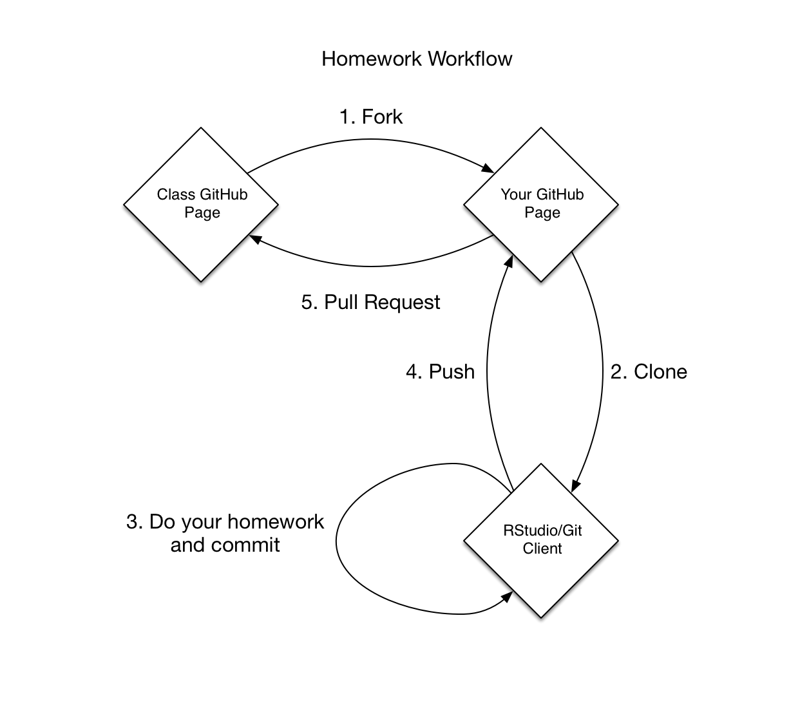

```{r setup, include=FALSE}
options(htmltools.dir.version = FALSE)
knitr::opts_chunk$set(cache = TRUE)

library(tidyverse)
library(broom)

theme_set(theme_minimal(base_size = 20))
```

---

# Quick hits

## Instructional staff

* Myself
* Fiona (TA)

## Course site

https://model.uchicago.edu

---

# Course overview

> Statistical learning methods are an important tool for computational social scientists seeking to conduct inference and prediction using observable data. This course presents a generic definition of a model in the social sciences, as well as a survey of a wide range of different types of statistical models used. While there is substantial overlap with the field of machine learning, this course focuses on methods emerging from statistics applied to supervised and unsupervised modeling, considering both the goals of inference and prediction. Students develop an understanding of the theory of how these methods work, assess the use of these models in published social scientific research, apply the methods computationally via Python or R, and interpret the substantive impact of the model results. As a survey course, students will be exposed to a wide range of modeling strategies, with the expectation that they later pursue deeper study into specific areas we cover.

---

# Course objectives

By the end of the course, students will:

* Define a range of statistical learning modeling strategies and demonstrate their theoretical properties
* Distinguish between modeling strategies and assess their individual strengths and weaknesses
* Read published research in the social sciences and analyze their modeling strategy
* Implement statistical learning algorithms using Python and/or R
* Utilize cross-validation methods
* Evaluate model performance
* Interpret the results of statistical models in terms of inference and prediction
* Visualize information and data using appropriate graphical techniques
* Apply statistical learning methods to standard (e.g. tabular) and non-standard (e.g. text, image, video) datasets
* Utilize stylistic principles of coding to generate reusable, interpretable code
* Debug programs for errors
* Generate reproducible research using computational notebooks such as [Jupyter Notebook](https://jupyter.org/) or [R Markdown](http://rmarkdown.rstudio.com/)

---

# Prerequisites

* [MACS 30000](https://github.com/UC-MACSS/persp-analysis_A18)
* [MACS 33001](https://css18.github.io/) or similar training in math and statistics
* CAPP 30121/MACS 30500, or a similar programming course in Python or R
* Experience using the Git workflow from the shell or a GUI interface (**no uploading via GitHub.com**)
* Avoid other machine learning courses this term

---

# Topic roadmap

| Week | Monday | Wednesday |
|------|-------------------------------------------------|-----------------------------------------------------|
| 1 | Theory and model building | Model fitting and selection |
| 2 | Exploratory data analysis/descriptive analytics | Unsupervised learning |
| 3 | MLK (no class) | Linear regression |
| 4 | Logistic regression/LDA | Prototype methods (naive Bayes & nearest neighbors) |
| 5 | Resampling methods | Linear model selection and regulation |
| 6 | Non-linear regression | Kernel smoothing methods |
| 7 | Tree-based inference | Tree-based inference |
| 8 | Support vector machines | Interpreting model results |
| 9 | Neural networks | Neural networks |
| 10 | Deep learning (TensorFlow and Keras) | Deep learning (text and sequences) |

---

class: center


---

class: center


--

.left[
* Use R
* Use Python
* Check out the FAQ
]

---

# Description of assignments

| Assignment | Quantity | Points | Total Points | Percent |
|------------------|----------|--------|--------------|---------|
| Problem Sets | 10 | 10 | 100 | 83.3% |
| Final exam | 1 | 20 | 20 | 16.7% |
| **Total Points** | -- | -- | 120 | 100% |

--
* Weekly problem sets
* Combination of theoretical and application problems
--
* Theoretical problems
    * Mathematical or simulation-based exercises to demonstrate certain properties of statistical learning methods
    * Level of complexity somewhere between ISL and ESL/PRML
    * Any time you need to use mathematical notation, use proper formatting
--
* Application problems
    * Apply the method(s) to real-world datasets
    * Implement the method correctly
    * Present the results in an informative manner
    * Interpret the results accurately

---

class:center

# Submission process



---

Any questions?

---

# Social science model

* Simplified representation of the real world.
* Process of trial-and-error
    * Build an initial model
    * Evaluate its effectiveness
    * Revise your model
* Not driven purely by predictive power

### Model vs. theory

* Theory - a reasoned and precise speculation about the answer to a research question, including a statement about why the proposed solution is correct
* Model - a simplification of, and approximation to, some aspect of the world
* Lots of forms of models

---

class:center

# Potential models


--


---

# 7 steps to building a model

1. Get an idea
1. Decide to pursue the idea
1. Examine the literature (or don't)
1. Build your model
1. Make mistakes
1. (Re)Turn to the literature
1. Give a seminar

---

# Get an idea

* Ideas are easy to generate - you want a **good** idea
* Where can you find ideas?
    * Academic journals
    * Newspapers, magazines
    * Talking to people (including non-academics)
* High-risk vs. high-reward

---

# Decide to pursue the idea


---

# Decide to pursue the idea

* Can you phrase it as a question?
* Can you meaningfully explain it to a non-expert?
* Is it interesting?

---

# Examine the literature (or don't)

* When should you consult with the published literature?
* Don't look too soon
    * Potentially more work - could reinvent the wheel
    * Good practice
    * May come up with a different approach than what people have done before you
    * Generate new ideas just by beginning the process of modeling
* Eventually you will do a thorough review of the literature

---

# Build your model

* Identify the outcome of interest (**endogenous variable(s)**)
* Identify relevant variables that will explain, predict, and lead to understanding of the outcome of interest (**exogenous variables**)
--

* Work a simple example first
    * KISS: Keep It Simple Stupid
    
.center[


> [Your model] should be as simple as possible...but no simpler.
]
    
* Then generalize your model piece by piece

---

# Three rules of thumb for model building

1. Think "process"
1. Develop interesting implications
1. Look for generality

---

# Make mistakes

class:center


---

# (Re)Turn to the literature

* If you have not already, begin your literature search
* Run searches on [Google Scholar](https://scholar.google.com/)
* Talk to senior/junior colleagues
* Puts the value of your contribution in context
    * Very important for publication
* You may find out someone else already did what you did - it sucks

---

# Give a seminar

* Show your work to other people
    * Giving a seminar/talk is often the easiest way for both parties to communicate
* You can lose perspective when you are deep in the trenches of your project
    1. You may think something is obvious, when it is not to others
    1. You may think something is complicated, when it is really obvious

---

# Practice building a model

* What is the research question?
* What is the process in question?
* What are the key factors?
* What is exogenous, and what is endogenous?
* How can you get data on these things?

--

## Possible topics

* Murders are up in Chicago
* Effect of fake news on elections
* Effect of lying on political candidates
* When do you get married?
